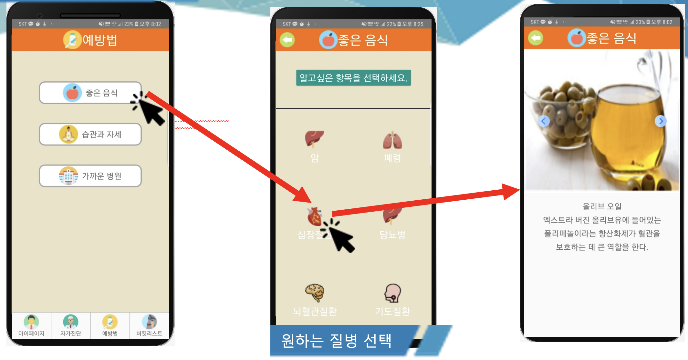

# 설계 목표

- ## 건강지킴이
	- 무엇을 만들 것인가: 
		- 노인들의 사망원인 중 95%가 질병사망이다.   
		- 설계목표는 질병의 초기증상을 자가진단하여 병에 걸린것을 조기에 알 수 있도록 어플을 만드는 것이다.  
	- 동작절차: 
		- 첫화면에 남자와 여자 버튼 두 개를 만들어 하나를 선택할 수 있게 한다. 이유는 남자의 경우 ‘암’이라는 항목에서 질병률이 위암,대장암이 제일 높고,여자의 경우 유방암,갑상선암이 질병률 이 가장높기 때문이다.    
		- 성별을 선택하면 두 번 째 화면으로 넘어간다. 두 번째 화면에는 자신이 궁금한 질병을 선택할 수 있다. 예외적으로 암을 선택한 경우 남,녀에 따라 다른 암들을 선택할 수 있게한다. 
		- 그 다음 화면에는 선택한 병에 관련된 초기증상을 나열하고 해당되는 사항을 체크박스로 선택할 수 있게 한다. 
		- 네 번째 화면에서는 체크된 박스의 수에 따라 안전, 경고, 위험으로 분류하여 결과창을 띄운다.
 분류된 화면에 따라 경고나 위험은 병원위치나 병원번호,홈페이지정보를 띄운다.

> 자세한 내용은 PPT와 최종보고서참고

예시)
